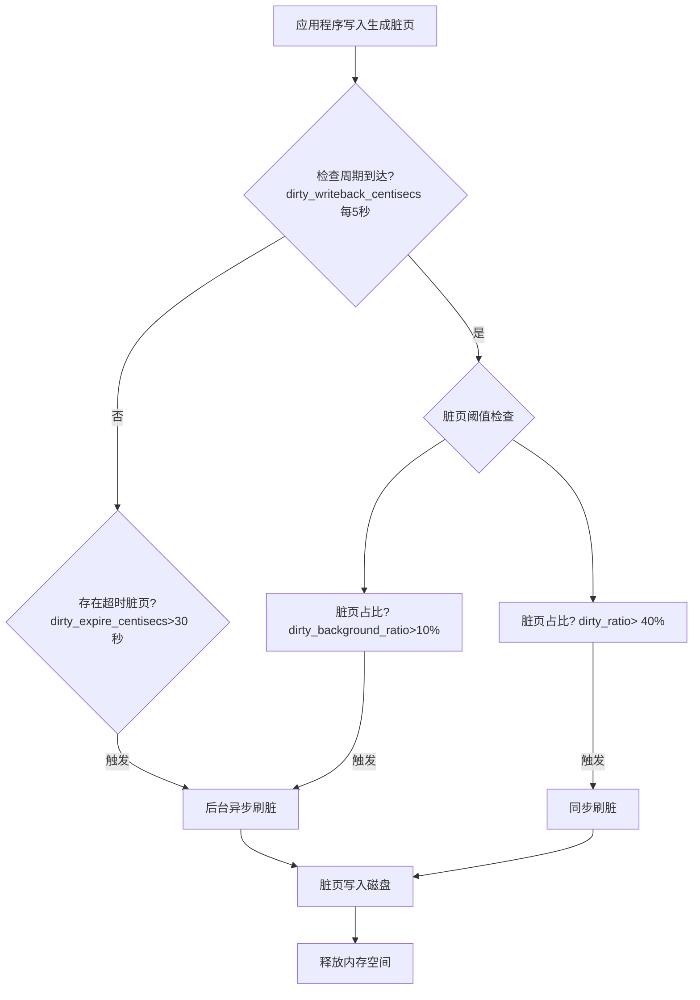
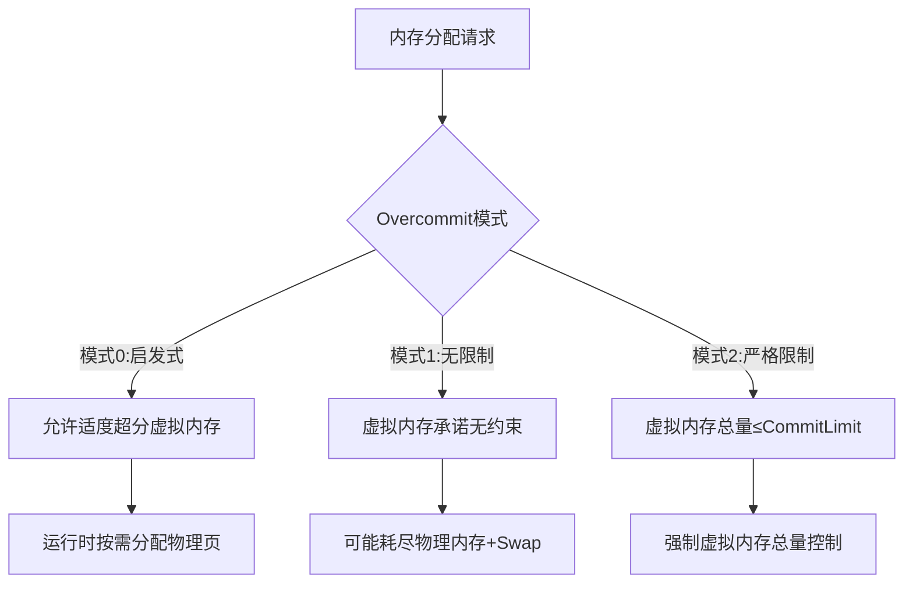

（内存基础知识参考 [linux内存浅析](https://blog.csdn.net/qq_40687433/article/details/135492312?spm=1001.2014.3001.5501)，本篇只有其上的内存知识）

## 内存基本概念

### buddy

buddy系统申请和合并page的过程，略。

容易忽略的知识点：

- buddy合并2个同大小块的前提它俩的**物理地址连续**
- 合并算法是迭代的，本级合并后会自行尝试合并更大的块。也就是说可以不依赖compactd来处理合并


### page table & PTE

page table和PTE其实是两个不同的概念，十分容易混淆，因为他们总体还是在说页表。以下是page table和PTE的相关知识[^ 《深入理解Linux内核》]

- PTE存储了页框的物理地址
- “page table”和“Page Table”是不同的概念，“page table”指保持线性地址和物理地址之间映射的页，“Page Table”是上层页表中的页
- pte_t、pmd_t、pud_t、pgd_t 分别描述页表项、页中间目录项、页上级目录项、页全局目录项
- PTE是Page Table Entry


如果只是看MMU缓存虚拟内存到物理内存映射区pagetable大小，把pagetable和PTE混淆差别不大；如果要深入到页表目录，需要将两个概念分开。


### TLB

每一级的页表是存储在内存里的，在完成一次虚拟内存地址转换的过程中，需要把当前虚拟地址对应的四个页表全部找出来，才能完成从虚拟地址到物理地址的转换。**说明一次内存IO仅虚拟地址到物理地址的转换就要区内存查4次页表**。Translation Lookaside Buffers，就是专门用于加速虚拟地址到物理地址转换速度的缓存。

关于TLB的位置，它通常位于L1缓存中（也有说在寄存器orL2的，应该跟cpu架构有关系，权且就当成cpu缓存，与主存区分）[^ Internminne og Cache,TLB L1]：


在现代处理器中，L1缓存通常被划分为多个部分，包括数据缓存dTLB、指令缓存iTLB。频繁地修改页表会导致导致访问主存次数增加，这会使CPU频繁地刷新TLB缓存 [^ 《深入理解Linux内核》]。TLB也是有大小的，提升TLB的命中率可以减少对主存pagetable的访问。使用大页可以降低PTE三个数量级，TLB Miss会大大降低。[^ 《深入理解Linux进程和内存》]。


TLB的信息：

```shell
#cpuid -l
   L1 TLB/cache information: 2M/4M pages & L1 TLB (0x80000005/eax):
   L1 TLB/cache information: 4K pages & L1 TLB (0x80000005/ebx):
...
   L2 TLB/cache information: 2M/4M pages & L2 TLB (0x80000006/eax):

```


观察TLB命中率:

```shell
perf stat -e dTLB-loads,dTLB-load-misses,iTLB-loads,iTLB-load-misses -I 10000 -p $PM_PID 
```

在内存回收时，观察TLB missing确实会上涨，但难以形成因果关系，TLB missing只是观察MMU的一种观测指标，TLB is part of MMU。

### 反向映射

PFRA（page fram reclaiming algorithm）页框回收算法总体原则[^ 《深入理解Linux内核》]：

1. 首先释放“无害”页。先回收pagecache上的无害页，这些页没有被任何进程占用
2. 用户态进程的所有页定位可回收页。FRPA将睡眠时间较长的用户态页可逐渐失去页框
3. 取消一个共享页框的所有页表项的映射，然后就可以回收该共享页框
4. 只回收“未用”页


PFRA目标之一就是能释放共享页框，能快速定位指向同一页框的所有页表项的过程就叫反向映射（reverse mapping）。

Reverse mappings for shared

- Anonymous pages
- File-mapping pages 


Basic tricks of page frame reclaiming

- LRU lists
- Free cheapest pages first
- Unmap all at once
- Etc[^ UNIVERSITY OF NORTH CAROLINA ,Page Frame Reclaiming]

### 大页

开启大页对特定应用的负载有一定提升。在pg中，大内存库开启大页也有一定的性能提升，甚至有一些稳定性的好处。

为什么大页更好？[^ kernel.org, Page Table Management]：

- 减少TLB的压力
- 减少pagetable在主内存上的大小
- 大页在物理上是连续的。连续的物理内存访问比不连续的物理内存访问更优
- When using these kinds of larger pages, higher level pages can directly map them, with no need to use lower level page entries[^ kernel.org,mm pagetables]


不过使用大页会带来管理上的挑战：

- 需要提前分配大页
- 需要提前计算大页大小，以避免内存浪费


进程使用大页的两种方式：

- The first is by using `shmget()` to setup a shared region backed by huge pages
- the second is the call `mmap()` on a file opened in the huge page filesystem


### C库和系统调用

内核空间和用户空间之间的中间层就是系统调用层。应用编程接口（API)和系统调用是不同的。应用程序调用用户空间的实现的应用编程接口来编程，而不是直接执行系统调用。在UNIX的世界里，最通用的系统调用层是POSIX标准(Portable Operation System Interface of UNIX)。POSIX标准针对的是API而不是系统调用。Linux操作系统的API通常以C标准库方式提供，如libc库。C标准库提供了POSIX的绝大部分API的实现。[^《奔跑吧 Linux内核 入门篇（第2版）》]

C app->C lib->system calls->OS->hardware[^ UNIVERSITY of WASHINGTON,PPT, POSIX I/O, System Calls]:


常见C库和系统调用：

malloc,free=>C lib

mmap、brk、munmap=>系统调用


### 缺页异常

缺页异常（or缺页中断）需要区分两种情况：由编程错误所引起的异常；用虚拟地址空间但尚未分配物理页框所引起的分配物理页的行为。[^ 《深入理解Linux内核》]

- 异常的缺页：Segment Fault——每个虚拟内存区域具有相关权限。如果一个进程访问了不在有效范围内的内存区域，或者非法访问了内存区域，或者以不正确的方式访问了内存区域，那么处理器会报告缺页异常，严重的会报告“Segment Fault”段错误并终止进程[^《奔跑吧 Linux内核 入门篇（第2版）》]。

- 正常的缺页：mmap、brk等系统调用都是管理虚拟内存的，它们不直接分配物理内存。虚拟内存系统调用函数只建立进程地址空间，在用户空间里可以看到虚拟内存，但没有建立虚拟内存和物理内存直接的映射关系。当进程访问这些还没有建立映射关系的虚拟内存时，触发缺页中断。[^《奔跑吧 Linux内核 入门篇（第2版）》]


缺页类型也分两种

- minor fault：没有阻塞当前进程的情况下处理了缺页，分配了页框

- major fault：缺页迫使当前进程睡眠（很可能是用磁盘上的数据填充页框花费时间），阻塞当前进程缺页就是主缺页major fault[^ 《深入理解Linux内核》]


### 写时复制COW

当执行fork系统调用时，子进程和父进程拥有独立的进程地址空间，但是共享物理内存资源，包括进程上下文、进程栈、内存信息、文件描述符、目录、资源限制等。只需要复制父进程中页表给子进程。此时以只读方式共享，当需要写入时（运行各自的任务时），数据才会被复制，使父进程和子进程拥有各自的副本。[^《奔跑吧 Linux内核 入门篇（第2版）》]

对于PG多进程来说，fork本身不算重，可能只需要关心页表，但是fork之后到来的各种任务会发生写时复制创建子进程自己的资源副本。

**注意区分写时复制和缺页异常：写时复制是说的fork时没有分配相应的资源给子进程；缺页异常是说的这个进程发生了物理内存分配，跟fork没有关系。**

### mmap、brk&共享内存映射区、堆区

mmap、brk的功能和所使用的内存地址区域是不同的：

- **`mmap` 用于管理共享内存，对应共享内存映射区**
- **`brk` 用于管理私有内存，对应堆区**


线性地址分区功能：

- mmap ：映射区域至顶向下扩展，mmap 映射区域和堆相对扩展，直至耗尽虚拟地址空间中的剩余区域，这种结构便于C运行时库使用mmap 映射区域和堆进行内存分配。
- 栈区(Stack)：存储程序执行期间的本地变量和函数的参数，从高地址向低地址生长
- 堆区(Heap)：动态内存分配区域，通过 malloc、new、free 和delete 等函数管理
- 未初始化变量区(BSS)：存储未被初始化的全局变量和静态变量
- 数据区(Data)：存储在源代码中有预定义值的全局变量和静态变量
- 代码区(Text)： 存储只读的程序执行代码，即机器指令。


共享内存映射区和堆区[^ Linux可执行文件与进程的虚拟地址空间] ：


真实的postmaster的堆区和共享内存映射：

```shell
cat /proc/1063005/smaps |grep -E "\-s|heap"
022a4000-022ee000 rw-p 00000000 00:00 0                                  [heap]
7fef6019e000-7fef601a5000 rw-s 00000000 00:17 21                         /dev/shm/PostgreSQL.1291978332
7fef601a5000-7fef6098b000 rw-s 00000000 00:01 1052                       /dev/zero (deleted) #这是shared buffers的
7fef6e238000-7fef6e239000 rw-s 00000000 00:01 10                         /SYSV0011f702 (deleted)
```

可以看到heap和共享内存区的地址差不多能对上。


## VM

linux内核virtual memory子系统

目录：`cd /proc/sys/vm/`

### compact

#### concept & param

内存压缩（Compaction）是Linux内核用于解决内存碎片化问题的机制，通过合并空闲物理页，提升大块内存页的分配和压缩效率。

| 参数名                        | 功能定位                                      | 默认值/范围                                                  |
| ----------------------------- | --------------------------------------------- | ------------------------------------------------------------ |
| `compact_memory`              | 手动触发全局内存压缩操作                      | 写入1触发                                                    |
| `compaction_proactiveness`    | 控制主动压缩的触发频率                        | 4.x才有的参数。0-100（默认20）                               |
| `compact_unevictable_allowed` | 是否允许压缩不可回收页（如`mlock`锁定的内存） | 4.x才有的参数。0（禁止）或1（允许）                          |
| `defrag_mode`                 | 控制内存碎片整理的触发策略                    | 4.x才有的参数。0-3，0表示关闭自动compaction特性，只能手动压缩；1表示defer开启被动压缩。3.10默认1 |
| `extfrag_threshold`           | 大块内存不足时，触发压缩的阈值                | 0-1000（默认500）                                            |

压缩有3种模式（跟内核版本是否支持相关）：

- 被动压缩：`extfrag_threshold`是进程申请大块内存发现已经不足是否压缩，解决“已发生”的碎片问题。
- 主动压缩：`compaction_proactiveness`是主动控制压缩的积极性，优化“未发生”但可能出现的碎片风险。
- 手动压缩：`compact_memory`。


`extfrag_threshold`是Linux内核中控制被动压缩的参数。当内核尝试分配高阶连续物理内存（如大页）失败时，会通过碎片化指数判断失败原因：

- `-1`：分配成功（满足水位线）
- `0`：因内存不足失败
- `1000`：因碎片化失败

通过`/sys/kernel/debug/extfrag/extfrag_index`查看具体值，其输出为浮点数（如`0.854`），但实际范围被放大1000倍，例如`0.854`对应实际值854：

```shell
cat /sys/kernel/debug/extfrag/extfrag_index |grep Normal
Node 0, zone   Normal -1.000 -1.000 -1.000 -1.000 -1.000 -1.000 -1.000 -1.000 -1.000 0.995 0.998 
```

若extfrag_threshold=600，则当碎片化指数>600时触发压缩。extfrag_index还是挺有用的，可以协助buddy观察碎片问题。


### dirty

#### concept & param

刷脏跟内存回收有点类似，也分异步和同步：

- 异步刷脏：由pdflush/flush/kdmflush等后台线程执行，应用写入不受影响
- 同步刷脏：直接阻塞应用进程，由发起写操作的进程自己刷脏


| 参数名称                  | 作用描述                     | 默认值       |
| ------------------------- | ---------------------------- | ------------ |
| dirty_background_bytes    | 后台异步刷脏阈值，字节       | 0（未启用）  |
| dirty_background_ratio    | 后台异步刷脏阈值，百分比     | 10%          |
| dirty_bytes               | 同步刷脏阈值，字节           | 0（未启用）  |
| dirty_ratio               | 同步刷脏阈值，百分比         | 20-40%       |
| dirty_expire_centisecs    | 脏页在内存中的最长存活时间   | 3000（30秒） |
| dirty_writeback_centisecs | 内核周期性检查脏页状态的频率 | 500（5秒）   |

xxx_bytes和xxx_ratio参数互斥。

示例参数和流程图：

```shell
dirty_background_bytes 0
dirty_background_ratio 10
dirty_bytes 0
dirty_ratio 40
dirty_expire_centisecs 3000
dirty_writeback_centisecs 500
```




刷脏参数的设置跟pg刷脏参数的基本原理差不多，设置的过低刷脏过于频繁，同一个脏页可能多次写入磁盘浪费IO，过高可能会有IO风暴。

#### 观察脏页

监控脏页

```shell
ps -eo pid,%cpu,%mem,wchan,args,state|grep kdmflush|grep -E -w -v "S" #观察异步刷脏进程状态
cat /proc/vmstat| grep -E -w "nr_dirty|nr_writeback"  #vmstat dirty,页数
cat /proc/meminfo |grep -i dirty                      #meminfo dirty，kb
```

使用dd测试脏页

```shell
 grep -E "nr_dirty_threshold|nr_dirty_background_threshold" /proc/vmstat | awk '{printf "%s: %.2fGB\n", $1, ($2*4)/1048576}'
nr_dirty_threshold: 141.28GB
nr_dirty_background_threshold: 35.32GB
```

```shell
dd if=/dev/zero of=testfile bs=8k count=128000               # cache io 
```

失败测试（测试多次仍然是这个结果）：

- 未见RUNNING kdmflush进程
- 没有满35GB，也没有满30S，脏页就被刷下去了


| 时间戳       | nr_dirty  | nr_dirty(GB) | 趋势模拟               |
| ------------ | --------- | ------------ | ---------------------- |
| **17:00:18** | 2,757     | 0.01052      | ▍                      |
| 17:00:19     | 336,199   | 1.282        | ████▌                  |
| 17:00:25     | 1,984,867 | 7.574        | ██████████████▍        |
| **17:00:32** | 4,252,177 | **16.22**    | ████████████████████   |
| 17:00:33     | 3,699,227 | 14.11        | █████████████████▊     |
| 17:00:38     | 170,865   | 0.652        | ▎                      |
| 17:00:46     | 2,865,814 | 10.93        | █████████▋             |
| **17:00:54** | 4,721,827 | **18.01**    | ██████████████████████ |
| 17:00:55     | 3,876,509 | 14.79        | ██████████████████     |
| 17:01:03     | 835,097   | 3.186        | ██▊                    |


#### os dirty !=pg dirty

pg fsync=on，数据写入是需要经过os pagecache然后再将指定块写入磁盘的。pg有自己的drity，os也有dirty，两者是什么关系？

```shell
## 观察语句
cat /proc/meminfo |grep -E -w "Dirty" # os脏页

select isdirty,pinning_backends,count(*) from  pg_buffercache where isdirty is true group by isdirty,pinning_backends; # pg脏页
```

```sql
checkpoint;
begin;
--观察
insert into tlzl select generate_series(1,1000000);
--观察
commit;
--观察
checkpoint;
--观察
```

测试结果：

| stage          | dirty in pg | os dirty                   |
| -------------- | ----------- | -------------------------- |
| 干净状态       | 0           | 0.02-2M 浮动               |
| insert完成     | 200M        | 上涨到1.7G，随后降落到20KB |
| commit提交     | 200M        | 0.02-2M 浮动               |
| checkpoint刷脏 | 0           | 0.02-2M 浮动               |

将插入数据加大，insert时os dirty会上涨，涨到GB级再浮动。

pg dirty跟os dirty有点关系但又不全是相关的，pg插入数据时 os dirty确实会上升，不过os自己刷脏后，pg的脏页仍然是脏页。初步判断共享内存中的脏页与os dirty无关，os dirty上涨暂未判断是不是pg私有内存的脏页。


### swappiness

控制系统从anonymous memory pool或 page cache 中回收内存的偏向性。其实是控制交换匿名页或者回收文件页，谁的代价对于上层应用来说更低。比如计算类的应用，动态分配或者私有内存使用更多，应该设置更低的swappiness，依赖数据的应用设置更高的swapiness以降低刷file page对数据访问的影响。不过这一切都建立在swap IO和filesystem IO的效率上[^Configuring an operating system to optimize memory access]。一切都很美好，但是swap发生时很可能意味着性能降低。

#### swappiness=0

`swappiness=0`时，内核会直到内存到达high水位线时，才会做swap[^linux kernel doc vm]。具体的策略跟内核版本和NUMA也有关系。可以确认的是`swappiness=0`不代表关闭了swap，`swapoff -a`才是关闭swap功能。

```shell
#查看是否打开了swap
swapon --show
free -h |grep Swap
cat /proc/swaps
grep -E 'swap|none' /etc/fstab
cat /proc/meminfo|grep Swap

#监控swapping是否发生
cat /proc/vmstat|grep swp
sar -W 1
```


#### inconsistent swap behavior

os层的 /proc/sys/vm/swappiness 对 cgroups v1 的系统的swap特性几乎没有影响（has little-to-no effect on the swap）。此问题可能导致不一致的swap行为[^inconsistent swap behavior]。

发生场景（且）：

- vm.swappiness != cgroups memory.swappiness
- cgroups v1

发生原因：

systemd在启动初期创建cgroups，早于`sysctl.service`加载`/etc/sysctl.conf` ，vm.swappiness 无法限制cgroup memory.swappiness。问题在于，当os的swap行为和cgroup不同时，到底哪个该生效的问题。

解决办法：

- for cgroup v1，设置vm.swappiness = all cgroups memory.swappiness
- for cgroup v1，很多解决办法，参考https://access.redhat.com/solutions/6785021
- 使用cgroup v2。v2新增vm.force_cgroup_v2_swappiness参数，使cgroup的memory.swappiness失效


### memory overcommitment

#### concept & param

linux不是为每个虚拟地址预留物理内存，而是等到实际需要内存时才进行分配。overcommitment可以限制所有进程申请的总虚拟内存的大小，申请的内存超过限定的物理内存大小时，称为overcommit。

overcommit策略参数有三个：`overcommit_memory`，`overcommit_ratio`/`overcommit_kbytes`

`overcommit_memory`参数控制overcommitment策略：

- `0`(默认): 启发式overcommitment策略，允许轻微的overcommit，CommitLimit=物理内存+swap 。
- `1`: 无overcommit检查 
- `2`: 严格限制，禁止超过`CommitLimit`





当`overcommit_memory=`2时，`overcommit_ratio`和`overcommit_kbytes`参数只有一个会生效，此时的`CommitLlimit`计算如下：
$$
CommitLimit = (RAM - 大页内存) × \frac{overcommit\_ratio}{100} + SwapTotal
$$
or
$$
CommitLimit = (RAM - 大页内存) + overcommit\_kbytes + SwapTotal
$$
有点意思的overcommit accounting[^ overcommit accounting],mmap、brk、fork都计算在内，明显对pg是有影响的：

```
Status
------
o	We account mmap memory mappings
o	We account mprotect changes in commit
o	We account mremap changes in size
o	We account brk
o	We account munmap
o	We report the commit status in /proc
o	Account and check on fork
o	Review stack handling/building on exec
o	SHMfs accounting
o	Implement actual limit enforcement
```


#### reserve内存和overcommmit

`user_reserve_kbytes` ：在overcommit_memory=2时，为普通用户进程预留的物理内存，在系统内存严重不足时，确保普通用户仍能执行基本操作（如启动新进程、处理内存分配请求）。默认值为 min(3% of the current process size, 128M)。当设置为0时，单个进程可以分配（所有空闲内存-admin_reserve_kbytes）

`admin_reserve_kbytes`：为具备 `CAP_SYS_ADMIN` 权限的用户（通常是 root 用户）保留的物理内存，确保管理员恢复能力，确保系统管理员可以登陆并执行命令的保留物理内存。默认min(3%内存, 8MB)。严格限制overcommit模式时最好提高该参数。

```shell
$ cat user_reserve_kbytes  
131072
$ cat admin_reserve_kbytes 
8192
```


#### 观察overcommit

```shell
grep -E 'CommitLimit|Committed_AS' /proc/meminfo
sar -r 1
```

```shell
$ grep -E 'CommitLimit|Committed_AS' /proc/meminfo
CommitLimit:    203103492 kB
Committed_AS:   252170700 kB

$  sar -r 1
07:32:35 PM kbmemfree kbmemused  %memused kbbuffers  kbcached  kbcommit   %commit  kbactive   kbinact   kbdirty
07:32:37 PM  25472180 370249056     93.56     14588 274485956 252242936     62.91 233866528 103568816     12924
07:32:38 PM  25471904 370249332     93.56     14588 274487888 252242740     62.91 233851748 103570136     11180
```

观测指标含义：

- meminfo CommitLimit：由物理内存、Swap及overcommit参数共同计算得出的CommitLimit
- meminfo Committed_AS：当前所有进程已申请的虚拟内存总量
- sar -r kbcommit = Committed_AS
- sar -r %commit =kbcommit/总物理内存


smaps或者status也可以查看总申请的虚拟内存，但直接算smaps/status的总计虚拟内存重复计算了共享库文件，映射文件（如mmap），而`Committed_AS` 仅统计mmap、brk、fork等申请的内存，且不会重复计算共享内存。两者计算口径不同，看总虚拟内存还是看Committed_AS或者kbcommit就行。


### watermark

| 参数名称               | 作用描述                                                     | 引入版本                  | 默认值                           | 单位/范围                 |
| ---------------------- | ------------------------------------------------------------ | ------------------------- | -------------------------------- | ------------------------- |
| min_free_kbytes        | 定义系统保留的最小空闲内存量，直接影响内存水位 `watermark[min]` 的计算，确保系统在内存紧张时保留足够内存供关键操作使用 | 早期内核版本              |                                  | KB                        |
| watermark_scale_factor | 全局调节内存水位线间距（`high-low` 和 `low-min`）            | Linux 内核4.x（4.几未知） | `10`（ 0.1%物理内存）            | 最大`3000`（30%物理内存） |
| watermark_boost_factor | 临时提升内存高水位线（`high`），触发积极内存回收以减少碎片化 | Linux 内核4.x（4.几未知） | `15000`（即 1.5 倍原始高水位线） |                           |

#### min_free_kbytes

```shell
## 从zoneinfo中计算zone的总min等值
cat /proc/zoneinfo | grep -E -w "min|low|high"|grep -E -v "high:"| awk '
/min/ { total_min += $2 }
/low/ { total_low += $2 }
/high/ { total_high += $2 }
END {
  printf "总min: %d KB\n总low: %d KB\n总high: %d KB\n",
        total_min * 4, total_low * 4, total_high * 4;
}'
总min: 15828844 KB
总low: 19786048 KB
总high: 23743260 KB

#当前系统min值
cat min_free_kbytes
15828849
```

因为有其他zone，所有zone的总min加起来才差不多min_free_kbytes。Normal zone的min肯定比min_free_kbytes小一点点，只需要关注Normal zone就行了：

```shell
## Normal zone的min、low、high设置；page=4k
cat /proc/zoneinfo | grep -A 50 Normal | grep -E "min|low|high"
        min      3931615
        low      4914518
        high     5897422
```


在Linux 内核4.6前，min、low、high是固定比例，只能通过设置min_free_kbytes来改变low、high的值，**min：low：high=1：1.25：1.5**。

固定比例的问题：

本身应该提高low积极触发kswapd异步回收，降低min减少direct reclaim。在4.6前只能通过调整min来间接调整low/high，通过调整min来调整kswapd的delta工作缓冲。例如

|                                 | kswapd异步回收工作缓冲（low-min） | kswapd异步回收工作量（high-low） |
| ------------------------------- | --------------------------------- | -------------------------------- |
| min=1GB，low=1.25GB，high=1.5GB | 0.25GB                            | 0.25GB                           |
| min=10GB，low=12.5GB，high=15GB | 2.5GB                             | 2.5GB                            |

提高min是为了提高low和high。

过低的min值，会导致kswapd还没来得及异步回收更多的内存，direct reclaim就触发了。过高的min，不仅浪费了内存，也会导致内存回收动作更频繁，sys cpu会更多。Linux中默认的low与min之间的差值确实显得小了点。

#### watermark_scale_factor

如果可以直接调整min、low、high不是美滋滋吗？抱歉，linux内核没有（安卓有extra_free_kbytes）。但是，

linux4.x内核以后新增watermark_scale_factor参数可以调节参数之间的比例，比例不再是固定的了。其默认值为10，对应内存占比0.1%(10/10000)，最大为3000。当它的值被设定为1000时，意味着"low"与"min"之间的差值，以及"high"与"low"之间的差值都将是内存大小的10%(1000/10000)。

0.1%明显是小了，1T的内存，scale才1GB。


#### watermark_boost_factor 

watermark_boost_factor 用于优化内存外碎片化。它临时提高内存管理区的水位，即 zone->watermark_boost 从而提高内存管理区的高水位（ WMARK_HIGH），这样 kswapd 可以回收更多内存，内存规整模块（ compactd 内核线程）就比较容易合并大块的连续物理内存。 watermark_boost_factor 的默认值是 15000，表示会临时把原来的高水位提升到 150%。若把这个值设置为 0，则关闭临时提高内存管理区水位的机制[^CarlyleLiu‘s Blog Linux 内存管理（十二）内存调优]


### oom

OOM Killer 是内核模块不是一个进程。

| 参数名称                 | 作用描述                                                     | 默认值 |
| ------------------------ | ------------------------------------------------------------ | ------ |
| panic_on_oom             | 控制OOM发生时系统行为： **0: 不触发panic，启动OOM Killer** 1: 触发panic并停机 2: 触发panic后尝试内存释放 | 0      |
| oom_kill_allocating_task | 是否优先杀死触发OOM的进程（而非遍历进程树选择最优目标）： 0: 禁用 1: 启用 | 0      |
| oom_dump_tasks           | OOM发生时是否转储所有任务信息（用于事后分析）： 0: 禁用 1: 启用 | 1      |


#### oom_score

oom发生时，系统需要通过oom score决定要kill哪个进程。 每个用户进程都有3个oom score接口文件

```
-rw-r--r-- 1 postgres postgres 0 May 24 16:39 /proc/63766/oom_adj
-r--r--r-- 1 postgres postgres 0 May 24 16:39 /proc/63766/oom_score
-rw-r--r-- 1 postgres postgres 0 May 24 16:39 /proc/63766/oom_score_adj
```

oom_score是系统自动计算的动态oom分数，至少受以下影响：

- 很多子进程的 +分
- 运行很长时间的 -分
- low nice value +分 (nice value代表进程的cpu时间片优先级。nice值越低，优先级越高，CPU时间片分配更多)
- 直接访问硬件的 -分[^OOM-killer score]


除了linux自己算的oom分数，还可以自行调整（adj）oom分数。oom_adj是linux内核早期版本的，最好通过调整oom_score_adj接口文件来调整adj score。

| 参数/文件       | 作用                               | 示例值                         |
| --------------- | ---------------------------------- | ------------------------------ |
| oom_score       | 内核计算的原始评分（动态变化）     | 0~1000                         |
| oom_score_adj   | 用户自定义调整值，直接影响最终评分 | -1000~1000；-1000等价于禁用OOM |
| oom_adj（旧版） | 旧版调整参数，范围-17~15           | -17~15                         |


### lowmem_reserve_ratio

除了`min_free_kbytes`，还有一个最低内存保留参数，会可能导致进程申请内存失败，但他们功能有较大差别。

`lowmem_reserve_ratio` 是一个用于保护低端内存（DMA、DMA32）不被高端内存分配请求过度占用键内核参数。lowmem_reserve_ratio只是一个系数，并不是直接可用的数，内核会计算每个zone的保留页数。

```shell
#下面默认值
cat /proc/sys/vm/lowmem_reserve_ratio 
256     256     32
```

内存区域（zone）按优先级从低到高排列：DMA → DMA32 → Normal → HighMem。高优先级区域的分配请求可“借用”低优先级区域的内存，但需按比例保留一定内存供低优先级区域使用。

```shell
cat /proc/zoneinfo |grep -Ew "Node 0|protection|free"
Node 0, zone      DMA
  pages free     3976
        protection: (0, 2484, 386430, 386430)
Node 0, zone    DMA32
  pages free     415741
        protection: (0, 0, 383946, 383946)
Node 0, zone   Normal
  pages free     5658528
        protection: (0, 0, 0, 0)
```

例如DMA的 protection 表示：

- 0:本区分配，没有跨区分配的限制
- 2484：DMA为来自DMA32区域保留的页数。
- 386430：DMA为来自Normal区域保留的页数
- 386430：保留扩展字段，此场景中无意义


以上设置

- 当DMA32区申请DMA区的内存时，3976>2484，是有可能成功的
- 当Normal区申请DMA区的内存时，3976<386430，是不会成功的
- 地区向高区申请内存，不会受到该限制


### misc

还有一丢丢相关的参数，关系不大的没有列举

| 参数                         | 作用                                                         |
| ---------------------------- | ------------------------------------------------------------ |
| nr_hugepages                 | 大页数                                                       |
| ~~nr_overcommit_hugepages~~  | 大页的overcommit；The maximum is nr_hugepages + nr_overcommit_hugepages |
| ~~nr_hugepages_mempolicy~~   | NUMA本地化大页分配                                           |
| ~~hugetlb_shm_group~~        | 共享内存权限控制                                             |
| ~~hugetlb_optimize_vmemmap~~ | 重构大页元数据管理模型，减少大页元数据（struct page）的内存占用。linux 内核5.13开始支持 |
| max_map_count                | 限制单个进程可拥有的内存映射区域（VMA）的最大数量，默认65530 |
| zone_reclaim_mode            | NUMA下内存回收策略，例如从其他节点分配内存                   |
| stat_interval                | vm stat刷新频率，默认1秒                                     |
| vfs_cache_pressure           | 虚拟文件系统（VFS）缓存回收压力的参数，主要影响内核回收dentry、inode缓存的积极性 |
| page-cluster                 | swap readahead，一次交换多个page到swap分区。默认3，即一次8个pages |


## OS内存的观测和计算

/proc/meminfo，/proc/vmstat，/proc/zoneinfo中都有内存信息，很多信息还是重复的。差异就不列举了没啥意思，看一眼就知道了。


### free available的计算（未完成）

大体方向：(NR_FREE_PAGES+NR_FILE_PAGES-NR_SHMEM+NR_SWAP_PAGES+NR_SLBA_RECLAIMABLE-TOTALRESERVE_PAGES-root预留内存)

内核有估算可用内存，直接用公式计算available有点难计算出准确的值：

```shell
## 不太准确，别用
cat /proc/meminfo |grep -Ew "MemFree|Active\(file\)|Inactive\(file\)|SwapFree|SReclaimable|nr_shmem|Shmem"  |awk 'NR==1 {a=$2} NR==2 {b=$2} NR==3 {c=$2} NR==4 {d=$2} NR==5 {e=$2} NR==6 {f=$2 ;print (a+b+c+d-e+f)}' ;
cat /proc/meminfo |grep -Ew "MemAvailable";
```


### inactive_anon+active_anon != anon

why？

- 主要：Shmem 会单独统计共享内存的页数。nr_anon_pages 未包含共享内存页，而 nr_inactive_anon 和 nr_active_anon包含匿名共享内存页
- 次要：anon包含部分Unevictable （Mlocked又是Unevictable的子集）
- 其他统计口径差异影响不大


粗糙但比较准确的算法：nr_inactive_anon +nr_active_anon +nr_unevictable -nr_shmem

```shell
## 大页下适用；numa下不适用
## /proc/meminfo,/proc/zoneinfo,/proc/vmstat都可以计算

#/proc/vmstat
echo -n "anon_computed        : ";cat /proc/vmstat|egrep -w "nr_inactive_anon|nr_active_anon|nr_unevictable|nr_shmem"| awk 'NR==1 {a=$2} NR==2 {b=$2} NR==3 {c=$2} NR==4 {d=$2; print (a+b+c-d)}' ;\
echo -n "anon_real            : ";cat /proc/vmstat|egrep -w "nr_anon_pages"|awk '{print $2}'
anon_computed        : 15776924
anon_real            : 15772671

##/proc/zoneinfo Normal
echo -n "anon_normal_computed        : "; cat /proc/zoneinfo |grep Normal -A 50|egrep -w "nr_inactive_anon|nr_active_anon|nr_unevictable|nr_shmem"| awk 'NR==1 {a=$2} NR==2 {b=$2} NR==3 {c=$2} NR==4 {d=$2; print (a+b+c-d)}' ;\
echo -n "anon_normal_real            : "; cat /proc/zoneinfo |grep Normal -A 50|egrep -w "nr_anon_pages"|awk '{print $2}'
anon_normal_computed        : 15711170
anon_normal_real            : 15707402
```


### cache的计算

free命令中的buff/cache，可以通过文件页或者cache本身计算出来

```shell
echo -n "filepage+shmem:  ";cat /proc/meminfo |grep -Ew "Buffers|Active\(file\)|Inactive\(file\)|Shmem|SReclaimable"| awk 'NR==1 {a=$2} NR==2 {b=$2} NR==3 {c=$2} NR==4 {d=$2} NR==5 {e=$2 ;print (a+b+c+d+e)}';\
echo -n "cached:          ";cat /proc/meminfo |grep -Ew "Buffers|Cached|SReclaimable" | awk 'NR==1 {a=$2} NR==2 {b=$2} NR==3 {c=$2 ;print (a+b+c)}';\
free -k;

#执行结果：
filepage+shmem:  289417584
cached:          289419156
              total        used        free      shared  buff/cache   available
Mem:      395721236    79633516    26668564    84704912   289419156   178501152
Swap:       5242876           0     5242876
```


### 争议：shmem算不算cache？

很明显，上面在计算cache的时候，把shmem也算进去了。shmem理论上应该不属于cache的部分

实际上内核社区也讨论过这个事情[Why is Shmem included in Cached in /proc/meminfo?](https://lore.kernel.org/all/YS0Eq+tNe4Pr7O0X@casper.infradead.org/T/)，想把共享内存从cache中抛出去：

```c
> -	cached = global_node_page_state(NR_FILE_PAGES) -
> -			total_swapcache_pages() - i.bufferram;
> +	cached = global_node_page_state(NR_FILE_PAGES) -
> +			total_swapcache_pages()
> +			- i.bufferram - i.sharedram;
```

但是修改这个东西涉及向前兼容，问题就归结于向前兼容和修改一个信息表达的准确性谁更重要？

目前来看没有一个好的解决，反正现状就是这样了。

这个邮件还讨论到一些有意思的东西：

```
Another point of view is that everything in tmpfs is part of the page
cache and can be written out to swap
```

```
- Dirty: total amount of RAM used to buffer data to be written on
permanent storage (dirty). Gets converted to Cached when write is
complete. (Actually I would call this "Buffers" but Dirty is okay, too.)
- Cached: total amount of RAM used to improve *performance* that can be
*immediately dropped* without any data-loss – note that this includes
all untouched RAM backed by swap.
- Shared: total amount of RAM shared between multiple process that
cannot be freed even if any single process gets killed. (If this is even
possible to know - note that this would *only* contain COW pages in
practice. We already have Committed_AS which is about as good for real
world heuristics.)
```

- cache是不包含dirty的，可以直接drop不会造成数据丢失
- tmpfs是swapout


共享内存看上去是swapout，明显跟cache page可以直接drop的性质是不同的。pg的共享内存明显不可以直接drop。

所以对于pg来说，cache有共享内存一点，还是很重要的，不要默认以为没有。


### 内存页统计数据老对不上

计算内存页的时候，有些计算对不上，汇总原因如下：

- shmem算到cache中
- 看不到shmem中的文件映射和匿名映射pages
- nr_anon_pages 未包含共享内存页，而 nr_inactive_anon 和 nr_active_anon包含匿名共享内存页
- vm和cgroup的统计口径略有差别


## cgroup v1

### cgroup 内存管理

cgroup可以观察和限制匿名页，文件页，swap cache，kernel mem的使用情况。每个memcg都有独立的LRU，没有GLOBAL LRU的概念。

cgroup内存管理不同于cgroup cpu管理，1个任务可以申请很多cpu工作，达到cg cpu上线可延长执行时间来处理，但是这个任务占用的内存是工作内存，一个任务使用相同的物理内存。

cgroup管理cpu和内存的重要区别：

- 内存必须通过复用和回收来管理，一个任务的工作内存是真实占用的不可被其他任务使用的；CPU通过时间分配来管理，其他任务或cg组可以用到
- 内存需要即时可用，CPU通过时间片轮转，时间可以分散
- CPU control的核心是时间分配；Memory Control的核心是page计数


> The core of the design is a counter called the page_counter. The
> page_counter tracks the current memory usage and limit of the group of
> processes associated with the controller

Memory Control的核心是page计数，也就是说不是物理page分这些就是这些，这次申请的内存使用完后释放回free，下次申请基本上不会是同一个物理page[^ kernel.org,cgroup v1]。

物理page知道自己属于哪个cgroup：

```shell
				+--------------------+
				|  mem_cgroup        |
				|  (page_counter)    |
				+--------------------+
				 /            ^      \
				/             |       \
           +---------------+  |        +---------------+
           | mm_struct     |  |....    | mm_struct     |
           |               |  |        |               |
           +---------------+  |        +---------------+
                              |
                              + --------------+
                                              |
           +---------------+           +------+--------+
           | page          +---------->  page_cgroup|
           |               |           |               |
           +---------------+           +---------------+
```

mm_struct代表虚拟内存。每个虚拟内存都知道自己属于哪个cgroup；每个物理page都可以指向page_cgroup，即知道这个物理内存属于哪个cgroup[^ kernel.org,cgroup v1]。


### cgroup 参数和指标

cgroup通过接口文件配置和查看内存使用情况。

目录：`cd /sys/fs/cgroup/memory/xxx/`

内核内存和mem+swap可以单独设置或查看使用上限和使用情况：

```
memory.kmem.xxx  #kernel mem
memory.memsw.xxx  #mem+swap
```

以下只看mem相关的。

接口文件可分为三类：

- 只读-显示使用情况，权限:`-r--r--r--`
- 读写-控制参数，权限:`-rw-r--r--`
- 其他-特殊设置，权限:其他


具体含义如下，重要参数标出：

| type | 接口文件                        | 含义                                                         |
| ---- | ------------------------------- | ------------------------------------------------------------ |
| 只读 | `memory.numa_stat`              | numa维度mem stat                                             |
| 只读 | **`memory.stat`**               | **重要**，是主要的内存使用情况接口文件，有很多指标，下面单独分析 |
| 只读 | `memory.usage_in_bytes`         | usage_in_bytes is affected by the method and doesn't show 'exact' value of memory。不建议使用该文件查看cgroup的内存使用情况 |
| 只读 | **`memory.failcnt`**            | 内存使用量超过`memory.limit_in_bytes`的次数，累计值          |
| 读写 | `cgroup.clone_children`         | 控制子 cgroup 是否继承父级配置                               |
| 读写 | **`cgroup.procs`**              | 用于管理当前 cgroup 中的 进程组（进程 ID，PID）。**对于多进程的pg来说，就是把pg的所有进程，包括管理进程和backend都写入`procs`文件** |
| 读写 | `tasks`                         | 用于管理当前 cgroup 中的 线程（线程 ID，TID）。将进程 PID 写入 `cgroup.procs` 时，其所有线程 TID 会自动添加到 `tasks` |
| 读写 | `notify_on_release`             | 控制当 cgroup 中的最后一个任务（进程或线程）退出时，是否触发释放操作。容器管理才有可能打开，传统的cgroup管理默认都是关闭，数据库重启cgroup还是要保留的 |
| 读写 | memory.move_charge_at_immigrate | v2已启用该参数。迁移croup时charge归属规则                    |
| 读写 | memory.use_hierarchy            | 父cgroup是否限制子cgroup                                     |
| 读写 | **memory.limit_in_bytes**       | **cgroup内存上限**                                           |
| 读写 | **memory.soft_limit_in_bytes**  | **内存超限时回收超限的部分**                                 |
| 读写 | memory.max_usage_in_bytes       | cgroup使用峰值，属于观察指标                                 |
| 读写 | **memory.oom_control**          | oom_kill_disable 1--禁用oom<br/>under_oom 0是否处于OOM状态   |
| 读写 | **memory.swappiness**           | cg级别的swappiness                                           |
| 其他 | memory.force_empty              | 仅写入，写入 `0` 强制释放cgroup所有内存                      |
| 其他 | cgroup.event_control            | 事件通知接口，监听内存压力事件，需编程实现。常与memory.pressure_level配合使用 |
| 其他 | memory.pressure_level           | 内存压力通知级别                                             |


通过一个pg实例来看memory.stat中各个指标的含义。

这个pg实例配置为：

```shell
shared_memory_type=mmap
shared_buffers=64GB
clients 800个左右，running
```

```shell
cat memory.stat

cache 345587761152 						      #page cache！！！
rss 27332608                                  #匿名和swap cache内存大小，注意，跟OS的进程rss不同，这里明显不包含PG的共享内存
rss_huge 0                                    #of bytes of anonymous transparent hugepages，注意是匿名大页
mapped_file 61491769344                       # 文件共享内存大小，这里包含pg的共享内存
swap 0                                        # swap分区上的
pgpgin 389395357                              # rss+cache的charge pages
pgpgout 305016672                             # rss+cache的uncharge pages
pgfault 1954040341                            # 略
pgmajfault 17                                 # 略
inactive_anon 165728256                       # anonymous and swap cache memory on inactive LRU
active_anon 61549518848                       # anonymous and swap cache memory on active LRU list
inactive_file 138240962560                    # file-backed on inactive LRU list
active_file 145658613760                      # file-backed memory on active LRU list
unevictable 0                                 # 无法回收的内存
hierarchical_memory_limit 408021893120        #
hierarchical_memsw_limit 9223372036854771712  #
total_xxx                                     # hierarchical 
```

粗略来看（不看swap）cache+rss=inactive_anon+active_anon+inactive_file+active_file。

这上面的值还挺绕的，cache+rss跟[in]active_anon/file也难有直接对应关系，再加上mapped_file这个共享内存不知道该算到哪去，容易算晕。结合各种文档和测试，手搓脚本如下：

```shell
#cginfo_lzl
echo -n "shared_mem_mapped         : ";cat /sys/fs/cgroup/memory/$PGNAME/memory.stat|egrep -w "mapped_file"| awk '{print $2 / 1024 / 1024 /1024 }' ;\
echo -n "shared_mem_anon           : ";cat /sys/fs/cgroup/memory/$PGNAME/memory.stat|egrep -w "rss|inactive_anon|active_anon"| awk 'NR==1 {a=$2} NR==2 {b=$2} NR==3 {c=$2; print (b + c -a)/1024/1024/1024}' ;\
echo -n "pagecache                 : ";cat /sys/fs/cgroup/memory/$PGNAME/memory.stat|egrep -w "cache"| awk '{print $2 / 1024 / 1024 /1024 }' ;\
echo -n "pagecache_cache-share     : ";cat /sys/fs/cgroup/memory/$PGNAME/memory.stat|egrep -w "cache|mapped_file"| awk 'NR==1 {a=$2} NR==2 {b=$2; print (a - b)/1024/1024/1024}';\
echo -n "file_total                : ";cat /sys/fs/cgroup/memory/$PGNAME/memory.stat|egrep -w "inactive_file|active_file"| awk '{sum += $2} END {print sum /1024/1024/1024}';\
echo -n "anon_total                : ";cat /sys/fs/cgroup/memory/$PGNAME/memory.stat|egrep -w "inactive_anon|active_anon"| awk '{sum += $2} END {print sum /1024/1024/1024}';\
echo -n "total_used_rss+map        : ";cat /sys/fs/cgroup/memory/$PGNAME/memory.stat|egrep -w "rss|mapped_file"| awk '{sum += $2} END {print sum /1024/1024/1024}';\
echo -n "total_mem_file+rss+map    : ";cat /sys/fs/cgroup/memory/$PGNAME/memory.stat|egrep -w "inactive_file|active_file|rss|mapped_file"| awk '{sum += $2} END {print sum /1024/1024/1024}';\
echo -n "total_mem_rss+cache       : ";cat /sys/fs/cgroup/memory/$PGNAME/memory.stat|egrep -w "rss|cache"| awk '{sum += $2} END {print sum /1024/1024/1024}';\
echo -n "total_mem_anon+file       : ";cat /sys/fs/cgroup/memory/$PGNAME/memory.stat|egrep -w "inactive_file|active_file|inactive_anon|active_anon"| awk '{sum += $2} END {print sum /1024/1024/1024}';\
echo -n "total_memsw               : ";cat /sys/fs/cgroup/memory/$PGNAME/memory.stat|egrep -w "rss|cache|swap"| awk '{sum += $2} END {print sum /1024/1024/1024}';\
echo -n "hard_limit                : ";cat /sys/fs/cgroup/memory/$PGNAME/memory.limit_in_bytes| awk '{print $1 / 1024 / 1024 /1024 }'
```

```shell
#shared_buffers=2GB的库
shared_mem_mapped         : 1.69063
shared_mem_anon           : 1.69828
pagecache                 : 5.94717
pagecache_cache-share     : 4.25654
file_cache                : 4.24889
anon_cache                : 3.23096
total_used_rss+map        : 3.2233
total_mem_file+rss+map    : 7.47219
total_mem_rss+cache       : 7.47984
total_mem_anon+file       : 7.47984
total_memsw               : 7.47984
hard_limit                : 8
```


### cgroup rss和process rss的差异

```shell
#shared_buffers= 64GB,所有pg进程的rss排序
ps -eo pid,ppid,rss,args |grep `cat $PGDATA/postmaster.pid|head -1`|sort -k3 -rn
 97632  97627 61103720 postgres: lzlinst: checkpointer   
 97633  97627 59045152 postgres: lzlinst: background writer   
 97627      1 2322820 /paic/postgres/base/11.3/bin/postgres -D /paic/pg6888/data
 97637  97627 85116 postgres: lzlinst: pgsentinel   
 97697  97627 19620 postgres: lzlinst: dbmgr users [local] idle
 97634  97627 17932 postgres: lzlinst: walwriter   
250063  97627 14508 postgres: lzlinst: dbmon postgres [local] idle
 97636  97627 13220 postgres: lzlinst: stats collector   
248777  97627 11576 postgres: lzlinst: dbmon postgres [local] idle
 97635  97627  2980 postgres: lzlinst: autovacuum launcher   
 97638  97627  2376 postgres: lzlinst: logical replication launcher   
 97630  97627  1592 postgres: lzlinst: logger   
250185  39130   972 grep --color=auto 97627
```

一般来说，pg rss值最多的是checkpointer和bgwriter进程，因为rss代表的真实使用的内存，含共享内存部分，这2个要刷shared buffer脏页的进程占用最多。也有查数据过多的backend也可能rss值较高，不过一般是抽数或者全表扫的慢sql导致。

postmaster为什么很少？因为postmaster本身不需要做太多shared_buffer的操作，它只需要把共享内存的虚拟地址开辟下来，fork给其他进程用即可。

pm的子进程的共享内存地址是相同的，rss就不一定了：

```shell
$ cat /proc/97632/smaps |grep -A 3 "zero" #checkpointer
2b4fd87cf000-2b60a2143000 rw-s 00000000 00:04 15925397                   /dev/zero (deleted)
Size:           70411728 kB
Rss:            61087812 kB
Pss:            31429895 kB
$ cat /proc/97633/smaps |grep -A 3 "zero" #bgwriter
2b4fd87cf000-2b60a2143000 rw-s 00000000 00:04 15925397                   /dev/zero (deleted)
Size:           70411728 kB
Rss:            59043388 kB
Pss:            29394787 kB
$ cat /proc/97627/smaps |grep -A 3 "zero" #postmaster
2b4fd87cf000-2b60a2143000 rw-s 00000000 00:04 15925397                   /dev/zero (deleted)
Size:           70411728 kB
Rss:             2318408 kB
Pss:             1741764 kB
```

以上checkpointer和bgwriter占用最多的rss，且rss中大部分是共享内存。它们两个进程几乎平分了整个真实使用的共享内存，postmaster反倒使用不多。pm及其fork的所有子进程的共享内存的虚拟地址是相同的。

但是，cgroup中的rss只有几十MB，远小于进程的rss

```shell
cat /sys/fs/cgroup/memory/lzlinst/memory.stat |egrep -w "rss|mapped_file"
rss 88997888
mapped_file 52963262464
```

可以看出来，pg共享内存没有在cgroup stat rss的统计中。cgroup的rss没有计算file page以及shared file page。

linux kernel[^ kernel.org,cgroup v1]:

> Only anonymous and swap cache memory is listed as part of ‘rss’ stat. This should not be confused with the true ‘resident set size’ or the amount of physical memory used by the cgroup.


进程和cgroup内存统计差异[^ Linux中进程内存及cgroup内存统计差异]：

| 内存          | 单进程                             | 进程`cgroup(memcg)`    |
| :------------ | :--------------------------------- | :--------------------- |
| `cache`       | 无                                 | `PageCache`            |
| `mapped_file` | 无                                 | `file_rss + shmem_rss` |
| `RSS`         | `anon_rss + file_rss ＋ shmem_rss` | `anon_rss`             |

对于pg来说，stat中的rss不包含file map共享内存。pg官网把mmap描述为anonymous shared mem：

> Possible values are `mmap` (for anonymous shared memory allocated using `mmap`), `sysv` (for System V shared memory allocated via `shmget`) 


cg把pg mmap的内存算成mapped_file。

观察sysv和大页的情况，pg的memory.stat相关指标总结：

- stat中的rss不包含file map共享内存。观察来看，无论是mmap还是sysv，rss都不含pg的共享内存
- 同理，rss_huge也不含file map共享大页内存。观察来看，即便开启大页，stat也不含pg的共享内存
- 无大页时，pg的共享内存（mmap or sysv）均统计在memory.stat mapped_file下；有大页时，不在stat中的任何指标中，包括rss_huge


### mapped_file到底在哪里？


- **mapped_file在cache中，也在inactive_anon+active_anon中**
- **mapped_file也可以是匿名的，mmap/sysv都算在这里**

```shell
#shared_buffers=2GB的库
shared_mem_mapped         : 1.69063
shared_mem_anon           : 1.69828
pagecache                 : 5.94717
pagecache_cache-share     : 4.25654
file_cache                : 4.24889
anon_cache                : 3.23096
total_used_rss+map        : 3.2233
total_mem_file+rss+map    : 7.47219
total_mem_rss+cache       : 7.47984
total_mem_anon+file       : 7.47984
total_memsw               : 7.47984
hard_limit                : 8
```


### soft_limit_in_bytes

软限制（`memory.soft_limit_in_bytes`）是 cgroup 内存管理中的一种非强制约束。当 cgroup 的内存使用量超过软限制时，系统不会立即强制回收内存，而是会在 **全局内存压力较大时**（例如系统整体内存紧张）优先回收该 cgroup 的超额内存。

1. **触发条件**：全局内存压力（例如系统空闲内存不足）。
2. **调用路径**：`kswapd` → `balance_pgdat` → 检查 cgroup 软限制 → 触发回收。
3. **回收目标**：优先回收超出软限制的 cgroup 的内存页面。

```
+-------------------+    全局内存压力检测      +-------------------+
|    kswapd 线程     | ---------------------> |   balance_pgdat   |
+-------------------+                         +-------------------+
                                                  |
                                                  | 遍历内存区域并检查
                                                  v
                                      +---------------------------+
                                      | 检查各 cgroup 的软限制使用情况 |
                                      +---------------------------+
                                                  |
                                                  | 对超限 cgroup 触发回收
                                                  v
                                      +---------------------------+
                                      |   页面回收（LRU 链表扫描等）  |
                                      +---------------------------+

```

soft_limit_in_bytes机制很像high，v2的soft_limit_in_bytes已过期，新增min、low、high三个参数。


### 超卖对pagecache的影响

再说


### cg oom

正常来说，sharedbuffer=1/4的cg mem，那么在不计算私有内存的情况下，pagecache最大可以到3/4的cg mem。一般来说，正常的业务私有内存占用不会很多，如果cg mem打满是可以从cg pagecache中回收内存的（是直接内存回收，aliOS做了异步后台回收：[Memcg后台异步回收内存）](https://help.aliyun.com/zh/alinux/user-guide/memcg-backend-asynchronous-reclaim?spm=a2c4g.11186623.0.0.562f42bammLZmK)。所以测试cg oom最好的办法是用占用很多私有内存的会话而不是加压。

测试用例：

```shell
#观察score
-r--r--r-- 1 postgres postgres 0 May 24 16:39 /proc/63766/oom_score
rss # 随便哪个命令啦

## 一个可以占用很多私有内存的sql，很多union all有很多plan node
psql -d lzldb -tX -c "create table lzl1(col1 varchar(1));"
psql -tX -c "\o sqltext.sql" -c "
SELECT 'select col1 from lzl1' || ' union all'
FROM generate_series(1, 100000)
UNION ALL
SELECT 'select col1 from lzl1;'
FROM generate_series(1, 1);
" 

#调整stack参数不然sql会被掐掉
psql -d lzldb -c "set max_stack_depth=1024000" -f sqltext.sql
```

cg oom off:

wchan有oom信息，甚至有oom score，但不会被OOM killer干掉

```shell
## vm oom打开; 0:不触发panic，启动OOM Killer
$ cat /proc/sys/vm/panic_on_oom 
0

## cg oom关闭;1:禁用oom
$ cat  /sys/fs/cgroup/memory/$PGNAME/memory.oom_control
oom_kill_disable 1
under_oom 0


$ ps -eo user,ppid,pid,state,%cpu,%mem,stime,wchan:14,args,rss,vsz,sig_block |grep `head -1 $PGDATA/postmaster.pid` |grep -v grep 
postgres  19005    870 D  0.0  0.0 10:54 mem_cgroup_oom postgres: pg3ymhp2: lzluser  7216 2807460 0000000000000000
postgres  19005   3417 S  0.0  0.0 10:55 pipe_wait      postgres: pg3ymhp2: lzluser 22944 2808540 0000000000000000
postgres  19005  13069 D  0.0  0.0 11:10 mem_cgroup_oom postgres: pg3ymhp2: lzluser 11944 2808348 0000000000000000
postgres  19005  13104 D  0.0  0.0 11:10 mem_cgroup_oom postgres: pg3ymhp2: lzluser 12224 2808348 0000000000000000
postgres  19005  14352 D  0.0  0.0 11:10 mem_cgroup_oom postgres: pg3ymhp2: lzluser 11680 2808348 0000000000000000

cat  /sys/fs/cgroup/memory/$PGNAME/memory.oom_control
oom_kill_disable 1
under_oom 1

cat /proc/97994/oom_score
11

shared_mem_mapped         : 2.00019
shared_mem_anon           : 2.0023
pagecache                 : 2.0023
pagecache_cache-share     : 0.00211334
file_cache                : 0
anon_cache                : 8
total_used_rss+map        : 7.99789
total_mem_file+rss+map    : 7.99789
total_mem_rss+cache       : 8
total_mem_anon+file       : 8
total_memsw               : 8
hard_limit                : 8
```

目前看来，PG的进程在分配不到内存的时候也有可能跑崩，例如walwriter跑奔溃会导致其他进程都崩溃。

cg oom on：

用户进程因为oom score高而被kill，发送的是kill -9，pg绝大部分进程奔溃，postmaster `reset_shared()`后自动拉起其他进程。mesage和dmesg都有out of memory相关信息：

```shell
#cg oom打开
oom_kill_disable 0

pg log:
2025-05-29 19:10:45.945 CST,,,198877,,6838374d.308dd,4,,2025-05-29 18:30:37 CST,,0,LOG,00000,"server process (PID 236413) was terminated by signal 9: Killed","Failed process was running: select col1 from lzl1 union all

message:
May 29 19:10:45 lzlhost kernel: Memory cgroup stats for /t1lzldb: cache:8392988KB rss:8384228KB rss_huge:0KB mapped_file:7458316KB swap:0KB inactive_anon:1310184KB active_anon:15467032KB inactive_file:0KB active_file:0KB unevictable:0KB
May 29 19:10:45 lzlhost kernel: Memory cgroup out of memory: Kill process 236413 (postgres) score 497 or sacrifice child

dmesg:
[Thu May 29 18:26:27 2025] Memory cgroup stats for /t1lzldb: cache:8392988KB rss:8384228KB rss_huge:0KB mapped_file:7458316KB swap:0KB inactive_anon:1310184KB active_anon:15467032KB inactive_file:0KB active_file:0KB unevictable:0KB
[Thu May 29 18:26:27 2025] Memory cgroup out of memory: Kill process 236413 (postgres) score 497 or sacrifice child
[Thu May 29 18:26:27 2025] Killed process 236413 (postgres) total-vm:18828736kB, anon-rss:8328252kB, file-rss:2328kB, shmem-rss:1832kB
```


cg oom on和off对于pg库管理上的区别：

- on，cg oom killer会kill oom score高的进程，一般来说是用户进程
- off，cg oom killer不会启动。pg进程会hang，当然也可能自己恢复，但pg的关键进程（如walwriter）可能因内存不足而跑崩，实例一样可能挂掉。


注意这里说的cg oom，不是vm oom。系统级的vm oom由系统级的vm overcommit机制来判断。


### cg v1的问题

- 没有统计cg pagetable
- 没有统计cg slab
- 没有统计cg hugepage（hugepage是没有charge，还不是没有算进去）
- 没有统计cg异步、同步回收pages
- cg rss与process rss统计口径不统一
- shmem统计口径比较乱

## what' new in V2

V2 Officially released in Linux 4.5 (March 2016)[^What’s new in control groups(cgroups) v2]。

cgroup v2内存管理的提升和改变：[^kenel doc cgroup v2]

| cg mem接口文件                                               | 对比v1 | 含义                                                         |      |
| ------------------------------------------------------------ | ------ | ------------------------------------------------------------ | ---- |
| memory.current                                               | 重修   | 当前使用内存大小。移除没什么用的usage_in_bytes               |      |
| memory.min                                                   | 新增   | **跟vm的min/low/high不同**。vm的水位线是操作系统剩的内存，cg v2的水位线是cg mem使用的内存。memory.min为硬保护内存保护值，默认值为0。系统没有可回收内存的时候，也不会回收在该值边界及以下的内存[^cg minlowhigh] |      |
| memory.low                                                   | 新增   | 尽力而为的内存保护值，默认值为0。系统优先回收未被保护的cgroup组的内存。如果内存还不足，再回收memory.min到memory.low之间的内存。 |      |
| memory.high                                                  | 新增   | 内存回收警示值，默认为max。当cgroup组内存使用量达到high值，会触发对该cgroup及子节点的同步内存回收任务，将内存尽量限制在high之下 |      |
| memory.max                                                   | 重修   | 等价memory.limit_in_bytes                                    |      |
| **memory.reclaim**                                           | 重修   | 主动回收接口文件，v1只有memory.force_empty强制清空           |      |
| memory.peak                                                  | 重修   | 等价max_usage_in_bytes；超过peak会触发cg oom killer          |      |
| **memory.oom.group**                                         | 新增   | 控制 cg OOM killer时是否终止整个 cgroup（1）或仅单个进程（0）。默认为0.如果oom_score_adj=-1000，不会被kill |      |
| memory.events                                                | 新增   | 报告内存相关事件                                             |      |
| **memory.stat**                                              | 重修   | 改变较多，单独分析                                           |      |
| memory.zswap.current，memory.zswap.max，memory.zswap.writeback | 新增   | Zswap 是 Linux 内核中的一种**内存压缩交换机制**，通过压缩待交换的内存页，减少对磁盘的 I/O 操作，从而提升系统性能。其核心思想是将原本需要写入磁盘的交换数据压缩后暂存于内存中，仅在必要时才将数据写入物理交换设备（如 Swap 分区或文件） |      |
| soft_limit_in_bytes                                          | 移除   |                                                              |      |
| **memory.oom_control**                                       | 移除   | **代表v2无法直接关闭cg oom killer**；不过可以通过设置min/low/high和设置event内存事件通知等来精细化管理内存 |      |

v2 cg mem在管理上有如下优势：

- 相对v1，v2有更简单明了的层级管理
- v1只有OOM kill or freeze，v2有更多手段控制内存大小(如memory.min/low/high)
- v2更容易控制突刺负载[^facebook cgroupv2: Linux’s new unified control group system]
- 移除直接关闭cg oom killer的接口文件
- 增加memory_hugetlb_accounting


memory.stat：

| **参数**                                                     | **含义**                                                     | **v1 对应项**                                         |
| ------------------------------------------------------------ | ------------------------------------------------------------ | ----------------------------------------------------- |
| anon                                                         | 匿名页                                                       | active_anon+inactive_anon                             |
| file                                                         | 文件页，含 tmpfs                                             | active_file+inactive_file                             |
| **kernel (npn)**                                             | 总内核内存，包括kernel_stack, **pagetables**, percpu, vmalloc, **slab**以及其他内核内存的使用情况。 | 新增                                                  |
| kernel_stack                                                 | kernel stacks占用的内存量。                                  | 新增                                                  |
| **pagetables**                                               | page tables                                                  | 新增                                                  |
| sec_pagetables                                               | 二级页表，适合虚拟机、GPU 设备、网络加速卡等硬件资源隔离场景 | 新增                                                  |
| percpu (npn)                                                 | 存储per-cpu内核数据结构的内存大小                            | 新增                                                  |
| sock (npn)                                                   | network transmission buffers                                 | 新增                                                  |
| vmalloc (npn)                                                | vmalloc                                                      | 新增                                                  |
| **shmem**                                                    | b包括tmpfs, shm , shared anonymous mmap                      | 新增                                                  |
| zswap                                                        | zswap压缩本身消耗的内存                                      | 新增                                                  |
| zswapped                                                     | zswap了多少用户内存                                          | 新增                                                  |
| **file_mapped**                                              | **mmap()大小**                                               | 有点类似v1 mapped_file，不过mapped_file包含tmpfs、shm |
| file_dirty                                                   |                                                              | 同v1 dirty                                            |
| file_writeback                                               |                                                              | 同v1 writeback                                        |
| swapcached                                                   |                                                              | 同v1 swapcached                                       |
| anon_thp                                                     | 透明大页中的匿名页                                           | 新增                                                  |
| file_thp                                                     | 透明大页中的文件页                                           | 新增                                                  |
| shmem_thp                                                    | 透明大页的shm、tpfs、匿名mmap                                | 新增                                                  |
| inactive_anon, active_anon, inactive_file, active_file, unevictable |                                                              | 同v1                                                  |
| **slab_reclaimable**                                         | 意如其名                                                     | 新增                                                  |
| **slab_unreclaimable**                                       | 意如其名                                                     | 新增                                                  |
| **slab (npn)**                                               | 意如其名                                                     | 新增                                                  |
| workingset_refault_anon，workingset_refault_file，workingset_activate_anon，workingset_activate_file，workingset_restore_anon，workingset_restore_file，workingset_nodereclaim | refaulted相关page统计                                        | 新增                                                  |
| pswpin (npn)                                                 | swap in                                                      | 同v1 pgpgin                                           |
| pswpout (npn)                                                | swap out                                                     | 同v1 pgpgout                                          |
| pgscan (npn)                                                 | scanned pages (in an inactive LRU list)                      | 新增                                                  |
| pgsteal (npn)                                                | 回收的内存                                                   | 新增                                                  |
| **pgscan_kswapd (npn)**                                      | 意如其名                                                     | 新增                                                  |
| **pgscan_direct (npn)**                                      | 意如其名                                                     | 新增                                                  |
| pgscan_khugepaged (npn)                                      | 透明大页守护进程扫描的pages                                  | 新增                                                  |
| **pgscan_proactive (npn)**                                   | proactive主动扫描的pages                                     | 新增                                                  |
| pgsteal_kswapd (npn)，pgsteal_direct (npn)，pgsteal_khugepaged (npn)，pgsteal_proactive (npn) | 意如其名，pgsteal\*对应pgscan\*                              | 新增                                                  |
| pgfault (npn)                                                | 意如其名                                                     | 同v1 pgfault                                          |
| pgmajfault (npn)                                             | 意如其名                                                     | 同v1 pgmajfault                                       |
| pgrefill (npn)                                               | 在active LRU中扫描的pages                                    | 新增                                                  |
| **pgactivate (npn)**                                         | 移动到active LRU中的pages                                    | 新增                                                  |
| pgdeactivate (npn)                                           | 移动到inactive LRU中的pages                                  | 新增                                                  |
| pglazyfree (npn)                                             | 有内存压力时，推迟释放的pages                                | 新增                                                  |
| pglazyfreed (npn)                                            | 已回收的lazyfree pages                                       | 新增                                                  |
| swpin_zero,swpout_zero                                       | zero-filled pages；在Swap In 阶段，内核检测到页面内容全为零（Zero-filled），标记该页为“零页”并记录在元数据中，跳过磁盘 I/O 操作 | 新增                                                  |
| zswpin,zswpout,zswpwb                                        | zswap相关pages                                               | 新增                                                  |
| thp_fault_alloc (npn)，thp_collapse_alloc (npn)，thp_swpout (npn)，thp_swpout_fallback (npn) | 透明大页相关pages                                            | 新增                                                  |
| numa_pages_migrated (npn)，numa_pte_updates (npn)，numa_hint_faults (npn) | numa相关pages，其实还有memory.numa_stat                      | 新增                                                  |
| pgdemote_kswapd，pgdemote_direct，pgdemote_khugepaged，pgdemote_proactive | 没懂demote                                                   | 新增                                                  |
| **hugetlb**                                                  | 大页                                                         | 新增                                                  |

v2 cg mem在观测上有如下优势：

- 新增slab、pagetable、pgscank/pgsand/pgsteal、大页信息，这些都是v1没有的
- 更多具体特性相关的观测指标，比如sock 、vmalloc、透明大页、zswap压缩交互、swap_zero全零交互等
- 共享内存shmem和file_mapped指标分开


## wchan

Waiting Channel，name of the kernel function in which the process is sleeping

一般来说要检查D状态的进程的wchan，看看进程在等待什么内核函数。


`-`：Running tasks will display a dash ('-') in this column

`poll_schedule_timeout`: PM常见，-一般在运行状态

```shell
zz ***Fri May 2 04:50:10 CST 2025
postgres 141378      1  19  0.5  0.4 70585180 2322876 poll_schedule_timeout                  S 21:06:18 00:02:40 /paic/postgres/base/11.3/bin/postgres -D /paic/pg6888/data
zzz ***Fri May 2 04:50:43 CST 2025
postgres 141378      1  19  0.5  0.4 70585180 2322876 -                                      R 21:06:18 00:02:42 /paic/postgres/base/11.3/bin/postgres -D /paic/pg6888/data
```

`futex_wait_queue_me`: SLEEP进程常见。偶现D

```shell
postgres 455358 141378  19  4.7  1.0 70590684 5349576 futex_wait_queue_me                    S 03:01:12 00:02:47 postgres: t1lzldb: lzl test3 30.181.32.3(39801) COMMIT
```

`hugetlb_fault`：只见过hugepage刚加载，刚起负载时

`do_last`：虚拟文件系统（VFS）路径解析逻辑中的函数，负责处理文件路径的最后一个分量（如文件名或符号链接），并触发实际的文件操作

`lock_page_killable`： 以可中断方式锁定物理内存页；可中断性是说允许进程在等待页面锁时响应致命信号，如`SIGKILL`

`rpc_wait_bit_killable`：该函数与远程过程调用（RPC）机制相关，用于在内核中等待某个位标志的变更

`wait_on_page_bit`：等待页面标志位的状态变更（如PG_locked、PG_writeback）

`blkdev_issue_flush`：块设备层的刷新缓存函数；可能的调用链：用户调用`fsync()` → 文件系统（如ext4）将相关脏页提交至块设备层 → 调用`blkdev_issue_flush()`确保设备缓存刷新

`on_proc_exit`：注册进程退出时的清理函数

`ima_file_check`：属于IMA（Integrity Measurement Architecture）子系统，用于在文件访问时验证其完整性；典型的有`open()`调用

`flush_work`：等待任务完成

`call_rwsem_down_write_failed`：当尝试获取写锁（`down_write()`）失败时，此函数处理写锁竞争与等待逻辑。它通过自旋或睡眠机制让当前进程等待锁释放（`rwsem`（读写信号量））


`get_request` ：**iowait高时出现**；从块设备请求队列中获取空闲的请求结构体（`struct request`）。若队列已满（设备处理速度不足），线程将等待直至有可用请求

`lookup_slow`：VFS（虚拟文件系统）路径解析的慢速路径

```c
/**
 * lookup_fast - do fast lockless (but racy) lookup of a dentry
 * @nd: current nameidata
 *
 * Do a fast, but racy lookup in the dcache for the given dentry, and
 * revalidate it. Returns a valid dentry pointer or NULL if one wasn't
 * found. On error, an ERR_PTR will be returned.
 */
 static struct dentry *lookup_fast(struct nameidata *nd)

/* Fast lookup failed, do it the slow way */
static struct dentry *__lookup_slow(const struct qstr *name,
				    struct dentry *dir,
				    unsigned int flags)

static struct dentry *lookup_slow(const struct qstr *name,
				  struct dentry *dir,
				  unsigned int flags)
{
	struct inode *inode = dir->d_inode;
	struct dentry *res;
	inode_lock_shared(inode);
	res = __lookup_slow(name, dir, flags);
	inode_unlock_shared(inode);
	return res;
}
```

lookup_fast和lookup_slow都是在找dentry并返回dentry，lookup_fast会在dentry cache中寻找，如果失败会通过lookup_slow查找。


开大页压测，无直接内存回收，出现以下事件：

`lock_page`：**iowait高时出现**；内核尝试锁定一个内存页时，若页面已被其他线程/进程锁定，当前线程会进入等待状态。

`vx_svar_sleep_unlock`，`vx_ilock`，`vx_bc_biowait`，`vx_dio_physio`，`vx_rwsleep_lock`：

vx是Veritas 公司开发的日志型**文件系统**（现归属于 Symantec 及后续拆分后的 Veritas Technologies），设计目标为 高性能、高可用性的大规模数据存储，**主要面向企业级应用场景**。跟xfs、ext4一样是一种文件系统。


`pipe_wait`：当进程尝试从管道（Pipe）读取数据或向管道写入数据时，若管道缓冲区已满（写操作）或已空（读操作），当前线程会进入休眠状态，等待缓冲区状态变化

`pipe_write`：管道写操作的入口函数，当缓冲区满时，线程在此函数中休眠，等待可写空间

`congestion_wait`：当块设备 I/O 队列拥塞时（如请求队列已满或设备处理延迟），内核通过此函数让线程短暂休眠

`wait_iff_congested`：检查块设备队列是否拥塞，若拥塞则进入短暂休眠。与 `congestion_wait` 类似，但更轻量级，通常用于内存回收或脏页回写路径


`mem_cgroup_oom_synchronize`：`usage_in_bytes`达到`limit_in_bytes`时，标记oom_control.under_oom=1，是否启用OOM killer内核模块取决于oom_control.oom_kill_disable

`mem_cgroup_oom`:同`mem_cgroup_oom_synchronize`

### rmap_walk

PFRA目标之一是为了回收共享页框，为了达到这个目的，Linux 2.6内核能够快速定位指向同一页框的所有页表项，这个过程叫反向映射（reverse mapping）[^ 《深入理解Linux内核》]。

当已被一个进程引用的页框插入另一个进程的页表项（fork）时，应该也会发生rmap_walk

```shell
zcat hostlzl_ps_25.04.08.0900.dat.gz|egrep "\-D /dirlzl/pg5998/data|zzz"|less
zzz ***Tue Apr 8 09:10:50 CST 2025
postgres 209987      1  19  0.2  0.5 70247548 2117844 poll_schedule_timeout                  S 22:17:21 00:01:56 /dirlzl/postgres/base/postgressql/bin/postgresdb -D /dirlzl/pg5998/data
zzz ***Tue Apr 8 09:11:20 CST 2025
postgres 209987      1  19  0.2  0.5 70247548 2117844 poll_schedule_timeout                  S 22:17:21 00:01:56 /dirlzl/postgres/base/postgressql/bin/postgresdb -D /dirlzl/pg5998/data
zzz ***Tue Apr 8 09:13:08 CST 2025
postgres 209987      1  19  0.2  0.5 70247548 2117844 -                                      D 22:17:21 00:01:57 /dirlzl/postgres/base/postgressql/bin/postgresdb -D /dirlzl/pg5998/data
postgres 225076 209987  19  1.6  0.0 70247548 1720 rmap_walk                                 D 09:11:51 00:00:01 /dirlzl/postgres/base/postgressql/bin/postgresdb -D /dirlzl/pg5998/data
postgres 224924 209987  19  0.7  0.0 70247548 1728 rmap_walk                                 D 09:11:46 00:00:00 /dirlzl/postgres/base/postgressql/bin/postgresdb -D /dirlzl/pg5998/data
postgres 224817 209987  19  0.5  0.0 70247548 1720 try_to_unmap_file                         D 09:11:44 00:00:00 /dirlzl/postgres/base/postgressql/bin/postgresdb -D /dirlzl/pg5998/data
zzz ***Tue Apr 8 09:19:16 CST 2025
postgres 209987      1  19  0.3  0.5 70247548 2117884 poll_schedule_timeout                  S 22:17:21 00:02:00 /dirlzl/postgres/base/postgressql/bin/postgresdb -D /dirlzl/pg5998/data
postgres 250875 209987  19  0.0  0.0 70247548 2208 -                                         R 09:19:17 00:00:00 /dirlzl/postgres/base/postgressqlbin/postgresdb -D /dirlzl/pg5998/data
zzz ***Tue Apr 8 09:19:48 CST 2025
postgres 209987      1  19  0.3  0.5 70247548 2117884 poll_schedule_timeout                  S 22:17:21 00:02:01 /dirlzl/postgres/base/postgressql/bin/postgresdb -D /dirlzl/pg5998/data
```


### try_to_unmap_file

try_to_unmap_file()函数调用try_to_unmap_cluster()，而try_to_unmap_cluster()函数会扫描该线性区线性地址所对应的所有页表项，并尝试将他们清理[^ 《深入理解Linux内核》]。try_to_unmap_file()执行映射页的反向映射。注意，反向映射即通过pagetable反向寻找所有vma，并将共享物理页框回收。

### page_referenced

refenced和active用于控制page的活跃度，在页面回收中使用。refcount=0时表示空闲或即将要被释放的页面[^《奔跑吧 Linux内核 入门篇（第2版）》]。

在kernel.org doc的Object-Based Reverse Mapping中有对page_referenced()函数的描述[^ kernel.org, Page Table Management]：

> `page_referenced()` which checks all PTEs that map a page to see if the page has been referenced recently
>
> `page_referenced()` calls `page_referenced_obj()` which is the top level function for finding all PTEs within VMAs that map the page.
>
> If a page is mapped and it is referenced through the mapping, index hash table, this bit is set. It is used during page replacement for moving the page around the LRU lists


简言之，page_referenced()通过页框找到map的所有PTEs上的VMAs。这也是一个rmap的过程。

Linux 引入了两个页面标志符 `PG_active` 和 `PG_referenced` 用于标识页面的活跃程度，从而决定如何在两个链表（active LRU和inactive LRU）之间移动页面。


`PG_active` 用于表示页面当前是否是活跃的，如果该位被置位，则表示该页面是活跃的。`PG_referenced` 用于表示页面最近是否被访问过，每次页面被访问，该位都会被置位。

`page_referenced()`：**当操作系统进行页面回收时**，每扫描到一个页面，就会调用该函数设置页面的 `PG_referenced` 位。如果一个页面的 `PG_referenced` 位被置位，但是在一定时间内该页面没有被再次访问，那么该页面的 `PG_referenced` 位会被清除。[^Linux内核内存回收逻辑和算法(LRU)]。


## 内存观察指标

查看基本内存设置：


观察内存指标：


## 一些问题

### kswapd和直接内存回收是否会一起执行？

会。如果是水位线触发的内存回收，有pgscand时经常伴随pgscank，反之则不然。如果pgscank、pgscand均频繁，那么可以考虑调整内存回收水位线，调大delta，防止delta被快速冲破。

不过还有一种情况，碎片率较高的时候，free还有很多，也有可能直接触发阻塞式内存压缩，有pgscand，完全没有pgscank。此时调整水位线就没有什么用了，可以考虑开启大页内存并提升一定的sharedbuffer命中率，减少pagecache频繁分配切碎内存。


### pagetable过大对内存回收的影响

pagetable过大，会增加反向映射的代价和时间。在直接内存回收时需要通过反向映射，找到所有进程的虚拟地址空间VMA，然后取消所有进程的VMA页表映射。也就说进程数越多，pagetable越大，内存回收也就越慢。

**postgres的进程数越多，pagetable越大；shared buffer越大，pagetable也越大。**

开启大页内存可以减少500倍（4k=>2M）pagetable大小，不仅可以空出一定内存，也可以提升内存回收效率。


### shared buffers多大合适

sharedbuffers=1/4 cgmem 似乎以成为行业标准，但是实际情况要复杂的多。理论上，把sharedbuffers调小可以增加一点pagecache，实际上略微增大了整个缓存大小，把sharedbuffers调大略微减少了减少了整个缓存大小，但是提升了一定的sharedbuffer命中率。很明显，sharedbuffers调大了不好，调小了也不好。sharedbuffers调太小，pg自己能工作的内存就太小了，相当于把内存管理工作扔给了OS，OS回收pagecache时对性能也会有影响；sharedbuffers调太大，不仅pagecache被挤占，还需要考虑pg刷脏的影响，特别是写入较多的情况需要调整相应的bgwriter参数。

从粗糙的压测来看

- 不开大页，shared buffers=min(1/4 MEM,20GB)
- 开大页，shared buffers=min(1/4 MEM,60GB)

### 进程和线程的差别真的不大吗？

在任何linux内核资料中，都会说进程和线程的差别不大。无论是创建进程还是线程，内核中都是用同一个函数kernel_clone来实现的，唯一区别在于传入的参数不同，fork和clone的系统调用差不多[^ 《深入理解Linux进程和内存》]：


| **维度**     | **进程**                                                     | **线程**                                                     |
| ------------ | ------------------------------------------------------------ | ------------------------------------------------------------ |
| **childID**  | 每个进程都有独立的 `pid`（进程 ID）                          | 每个线程有 `tid`（线程 ID），但线程的 pid` 与所属进程的 `pid` 一致。 |
| **地址空间** | 每个进程拥有独立的地址空间（`mm_struct`），包括内存、堆栈等。 | 线程共享所属进程的地址空间，所有线程的 `mm_struct` 指向同一个地址空间。 |
| **文件系统** | 每个进程有自己的 `fs_struct`，包含文件描述符、挂载点等。     | 线程共享所属进程的 `fs_struct`，所有线程的文件描述符和挂载点与进程一致。 |

线程跟进程相比，只是稍微“轻量”了一点，总体来说进程和线程的相同点大于他们的不同点。

但是，进程多了以后区别可就大了，特别是像pg这样的多进程应用：

- 每个进程都有自己的VMA，所以要维护更多的地址空间
- 每个进程都有自己的pagetable，所以pagetable要占用更多的内存
- 多进程会增加TLB的刷新负担，而线程不会
- 进程切换需要更多的上下文开销，而线程不会
- 进程间通信IPC效率更低，而线程直接共享内存不会有IPC通信问题


可以这么说，**进程和线程在创建的时候差别不大，但是多进程管理和多线程管理差别很大**。

### 为什么从库会有pg层脏页？

从库日志回放机制本身会产生脏页，从库也会刷脏。可通过pg_buffercache查看从库脏页，从库的脏页跟主库不一样，从库脏数据也是一般的relation；同时可以观察到从库的checkpoint/bgwriter/backend刷脏都跟主库不一样。


### 为什么file cache有些库高有些低

一般来说是离散度多的库file cache比较多，简单的慢sql是比较难把file cache长期维持在较高水平的。一个慢sql访问较多数据，可能会短暂的升高filecache，但是过一会这些file page的reference下降，并成为inactive file pages后，内存可以回收这一部分内存。但是频繁的离散度，比如索引的correlation接近0，如UUID主键，其SQL性能较好但reads高，可能产生频繁物理IO，加载了太多的page到filecache中。甚至业务模型的转变会导致shared buffer的大量换入换出，对性能影响较大。


### pg进程和共享内存映射

```shell
#未开大页时，是/dev/zero （deleted）
cat /proc/102208/smaps |egrep "rw\-s" -A 1
2aefd8901000-2aefd8902000 rw-s 00000000 00:04 1202061313                 /SYSV00001000 (deleted)
Size:                  4 kB
--
2aefd8918000-2aefd898f000 rw-s 00000000 00:13 4084862058                 /dev/shm/PostgreSQL.1008001451
Size:                476 kB
--
2aefe2605000-2b00ad129000 rw-s 00000000 00:04 4084864418                 /dev/zero (deleted)

#开启大页时，是/anon_hugepage (deleted)
cat /proc/29091/smaps |egrep "rw\-s" -A 1
2aaaaac00000-2ac3a2c00000 rw-s 00000000 00:0e 215471503                  /anon_hugepage (deleted)
Size:           104726528 kB
--
2b48dfe93000-2b48dfe94000 rw-s 00000000 00:04 88604727                   /SYSV00001000 (deleted)
Size:                  4 kB
--
2b48dfeab000-2b48dff22000 rw-s 00000000 00:12 215515747                  /dev/shm/PostgreSQL.1123685558
Size:                476 kB
```

子进程页表都是从父进程中复制过来的，父子进程因此共享同一页框[^ 《深入理解Linux内核》]。所以无论是postmaster还是backend进程（任何postmaster fork出来的进程），在虚拟内存地址中都会映射相同的共享内存地址，他们在smaps中的地址和Size是相等的。


### 为什么pg的所有的进程的虚拟内存都是/dev/zero段占用多

mmap实现匿名页映射主要有两种方式：一种是通过设置`MAP_ANONYMOUS`标志并传入`fd=-1`，另一种是打开`/dev/zero`设备文件并将得到的文件描述符传递给`mmap`。这两种方法在功能上是等效的。

pg sharebuffer使用的/dev/zero设备映射来实现的匿名共享页，所以一般能看到pg进程的/dev/zero的虚拟内存地址占用是比较多。


## References

[^ 《深入理解Linux内核》]: 《深入理解Linux内核》：内存寻址、内存管理、地址空间管理、回收页框
[^ 《深入理解Linux进程和内存》]: 《深入理解Linux进程和内存》CPU硬件原理、进程、线程的对比


[^《奔跑吧 Linux内核 入门篇（第2版）》]: 《奔跑吧Linux内核入门篇（第2版）》系统调用、内存管理 

[^ UNIVERSITY of WASHINGTON,PPT, POSIX I/O, System Calls]:  https://courses.cs.washington.edu/courses/cse333/20wi/lectures/07/CSE333-L07-posix_20wi.pdf
[^ UNIVERSITY OF NORTH CAROLINA ,Page Frame Reclaiming]: https://www.cs.unc.edu/~porter/courses/comp630/s24/slides/pfra.pdf
[^ Internminne og Cache,TLB L1]:  https://www.cs.oslomet.no/~haugerud/os/Forelesning/os7.pdf
[^ kernel.org, Page Table Managemen]:  https://www.kernel.org/doc/gorman/html/understand/index.html 
[^ kernel.org,mm pagetable]:  https://www.kernel.org/doc/html/latest/mm/page_tables.html
[^ kernel.org,cgroup v1]: https://www.kernel.org/doc/html/latest/admin-guide/cgroup-v1/memory.html
[^ Linux中进程内存及cgroup内存统计差异]:  https://wiki.goframe.org/pages/viewpage.action?pageId=157646868 
[^inconsistent swap behavior]: https://access.redhat.com/solutions/6785021
[^linux kernel doc vm]:  https://www.kernel.org/doc/html/latest/admin-guide/sysctl/vm.html#swappiness
[^Configuring an operating system to optimize memory access]: [redhat,Configuringanoperatingsystemtooptimizememoryaccess](https://docs.redhat.com/en/documentation/red_hat_enterprise_linux/8/html/monitoring_and_managing_system_status_and_performance/configuring-an-operating-system-to-optimize-memory-access_monitoring-and-managing-system-status-and-performance#overview-of-a-systems-memory_configuring-an-operating-system-to-optimize-memory-access)

[^ overcommit accounting]:  https://www.kernel.org/doc/Documentation/vm/overcommit-accounting
[^CarlyleLiu‘s Blog Linux 内存管理（十二）内存调优]: https://carlyleliu.github.io/LinuxKernel/LinuxMemoryOptimization/
[^OOM-killer score]: https://www.man7.org/linux/man-pages/man5/proc_pid_oom_score.5.html

[^Linux内核内存回收逻辑和算法(LRU)]: https://www.cnblogs.com/muahao/p/10109712.html

[^kenel doc cgroup v2]: https://www.kernel.org/doc/html/latest/admin-guide/cgroup-v2.html

[^cg minlowhigh]:  https://support.huaweicloud.com/usermanual-hce/hce_02_0072.html

[^facebook cgroupv2: Linux’s new unified control group system]:  https://chrisdown.name/talks/cgroupv2/cgroupv2-fosdem.pdf

[^What’s new in control groups(cgroups) v2]: https://www.man7.org/conf/lca2019/cgroups_v2-LCA2019-Kerrisk.pdf

[^ Linux可执行文件与进程的虚拟地址空间]:  https://www.sohu.com/a/392831824_467784


[《深入理解Linux内核》]: 《深入理解Linux内核》： 内存寻址、内存管理、地址空间管理、回收页框

[《深入理解Linux进程和内存》]: 《深入理解Linux进程和内存》 CPU硬件原理、进程、线程的对比

[《奔跑吧 Linux内核 入门篇（第2版）》]: 《奔跑吧Linux内核入门篇（第2版）》 系统调用、内存管理 

[ UNIVERSITY of WASHINGTON,PPT, POSIX I/O, System Calls]:    https://courses.cs.washington.edu/courses/cse333/20wi/lectures/07/CSE333-L07-posix_20wi.pdf 

[ UNIVERSITY OF NORTH CAROLINA ,Page Frame Reclaiming]: https://www.cs.unc.edu/~porter/courses/comp630/s24/slides/pfra.pdf

[ Internminne og Cache,TLB L1]:  https://www.cs.oslomet.no/~haugerud/os/Forelesning/os7.pdf

[ kernel.org, Page Table Managemen]:  https://www.kernel.org/doc/gorman/html/understand/index.html 

[ kernel.org,mm pagetable]:  https://www.kernel.org/doc/html/latest/mm/page_tables.html

[ kernel.org,cgroup v1]: https://www.kernel.org/doc/html/latest/admin-guide/cgroup-v1/memory.html

[ Linux中进程内存及cgroup内存统计差异]:  https://wiki.goframe.org/pages/viewpage.action?pageId=157646868 

[inconsistent swap behavior]: https://access.redhat.com/solutions/6785021

[linux kernel doc vm]:  https://www.kernel.org/doc/html/latest/admin-guide/sysctl/vm.html#swappiness

[Configuring an operating system to optimize memory access]: [redhat,Configuringanoperatingsystemtooptimizememoryaccess](https://docs.redhat.com/en/documentation/red_hat_enterprise_linux/8/html/monitoring_and_managing_system_status_and_performance/configuring-an-operating-system-to-optimize-memory-access_monitoring-and-managing-system-status-and-performance#overview-of-a-systems-memory_configuring-an-operating-system-to-optimize-memory-access)

[overcommit accounting]:  https://www.kernel.org/doc/Documentation/vm/overcommit-accounting

[CarlyleLiu‘s Blog Linux 内存管理（十二）内存调优]: https://carlyleliu.github.io/LinuxKernel/LinuxMemoryOptimization/

[OOM-killer score]: https://www.man7.org/linux/man-pages/man5/proc_pid_oom_score.5.html

[Linux内核内存回收逻辑和算法(LRU)]:  https://www.cnblogs.com/muahao/p/10109712.html

[kenel doc cgroup v2]: https://www.kernel.org/doc/html/latest/admin-guide/cgroup-v2.html

[cg minlowhigh]:  https://support.huaweicloud.com/usermanual-hce/hce_02_0072.html

[facebook cgroupv2: Linux’s new unified control group system]:  https://chrisdown.name/talks/cgroupv2/cgroupv2-fosdem.pdf

[What’s new in control groups(cgroups) v2]: https://www.man7.org/conf/lca2019/cgroups_v2-LCA2019-Kerrisk.pdf

[ Linux可执行文件与进程的虚拟地址空间]:  https://www.sohu.com/a/392831824_467784


