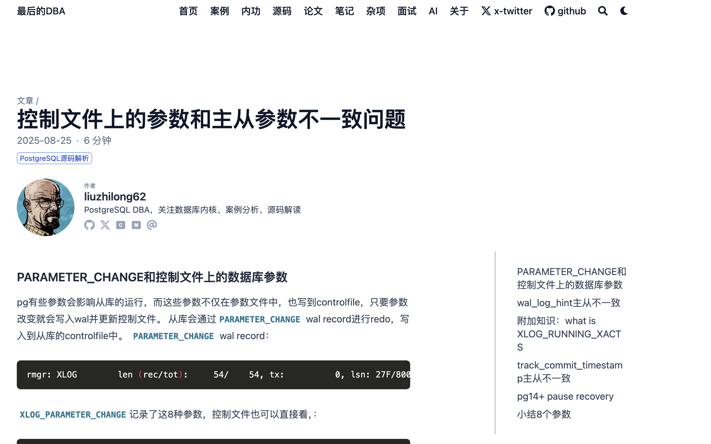

### 上线啦！

博客终于上线了。

地址：[https://lastdba.com](https://lastdba.com)

国内可以访问，手机访问也友好

76 篇文章，都是这几年写 PostgreSQL 的东西——案例、内功、源码、论文精读。

这次算是正式上线：换框架、换域名、换主题，从头到尾搞了一遍。

### 亮点

**界面漂亮**

界面简约，阅读友好，搜索功能也比较有用

**框架：Jekyll → Hugo**

第一版：Jekyll + minima 主题 + 2000 行 CSS

第二版：Hugo + Blowfish 主题 + 0 行 CSS

第一版其实也不错，就是自己搞UI很费劲，想到老冯之前写过一个文章关于网站架构选择的，我直接就上去白嫖了。把架构跟AI说明，让它偷学vonng.com，页面质感提升了一个档次，后面再调整调整细节就收工了。

**域名：github.io → lastdba.com**

买了 `lastdba.com`，配了 Cloudflare。GitHub Pages 绑自定义域名，免费 HTTPS 证书，全自动续。不用科学上网也可以访问了！

**图片本地化**

原来文章里的图片散落在各个地方——CSDN 的 CDN、GitHub PicBed、墨天轮 OSS。CSDN 有防盗链，不给看。GitHub PicBed又是外网的，国内经常加载不出来。这次让AI搞到本地路径，以后再也不怕图床跑路。跨网访问也不会有图片加载不出来的问题，very good。

### 上线感悟

其实博客网址以前也搞过，白嫖一个博客网站项目然后用GitHub Pages就可以搭建出来，域名是 `liuzhilong62.github.io/blogs`。但是由于个人有些质感癖（不是），效果一般般我就下线了，后面直接把github仓库当博客网址用，pages都没有搞。最近由于各种原因时间比较多，再次想起这个事情，就用hermes从头开始弄博客网站。

作为一个DBA，后端工程师，什么Jekyll，Hugo，Blowfish，css这些前端的东西我完全不懂，我只需要给Hermes目标，然后它做，它跟我说啥我也听不懂（当然也不好意思跟它说我搞不懂），基本就是"你继续"，我网页端看下效果满意就行，偶尔会"回退这个"。

说实话，换 Hugo 最大的感受不是技术上的，而是「不要重新发明轮子」。之前花了很多时间手写暗色模式、TOC、搜索，结果发现换个主题全自带，写得还不如人家好看。

另外，`lastdba.com` 这个域名挂上去之后，博客突然有了一种「正式感」。以前 `liuzhilong62.github.io/blogs` 像是个人的实验项目，现在像一个真正的网站。虽然内容没变，但感觉不一样了。

### 花了多少钱

全部费用：

| 项目 | 费用 |
|------|------|
| `lastdba.com` 域名（Cloudflare，1年） | ¥70 |
| GitHub Pages 托管 | ¥0 |
| Hugo 框架 | ¥0 |
| Blowfish 主题 | ¥0 |
| Cloudflare DNS + CDN | ¥0 |
| token | ¥60 |
| **合计** | ¥130 |

这可能是性价比最高的个人网站方案了。

---

### 最后

有些细节可能没有打磨好，欢迎反馈bug，优化建议

后面应该会持续更新

### 参考

https://vonng.com/

